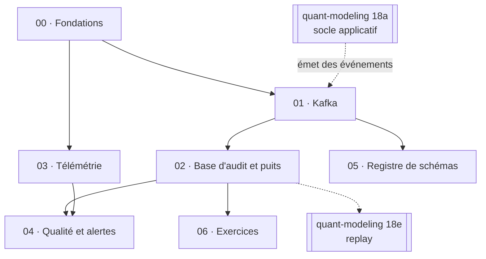

# Blueprint — quant-platform

Spécification du chantier. Un fichier par **lot de travail** dans
[`wp/`](wp/), les arbitrages avec leurs alternatives rejetées dans
[`decisions.md`](decisions.md), le contrat avec les producteurs dans
[`../docs/contract.md`](../docs/contract.md).

> **Origine.** Ce dépôt est né du lot 18 de `quant-modeling`
> (`~/quant-modeling/blueprint/wp/18-observability.md`), qui reste la **vue
> d'ensemble** des deux dépôts et décrit aussi la moitié « producteur ». Ici, on
> ne détaille que la moitié « plateforme ». En cas de divergence : le **contrat**
> est canonique ici ; le **code producteur** est canonique là-bas.

## 1. Pourquoi ce dépôt existe

Le projet `quant-modeling` a des replis silencieux sur des sources en direct,
aucun journal d'authentification, et ne peut pas répondre à « de quoi dépendait
ce prix mardi, et retrouve-t-on le même aujourd'hui ? ». La réponse est une
**piste d'audit** et une **télémétrie**. Elles sont ici, et pas dans le dépôt de
pricing, parce qu'une plateforme a un autre cycle de vie (redéployer l'API ne
doit pas redémarrer Kafka) et qu'elle servira à d'autres projets.

**Règle qui départage « même dépôt » et « dépôt séparé »** : deux choses vivent
dans le même dépôt si elles changent ensemble et doivent être livrées de façon
atomique ; sinon elles se parlent par un contrat versionné.

## 2. Deux buts, qui ne pèsent pas pareil

Le premier est pratique : voir les replis, les connexions, les pricings. Le
second est **pédagogique et explicite** : apprendre à monter ce qu'un desk monte.
Quand ils divergent — Kafka est surdimensionné pour ce volume, Postgres seul
suffirait — c'est le second qui gagne, et la documentation le dit.

## 3. Les lots

| WP | Titre | Correspond au lot de `quant-modeling` | Résumé |
|---|---|---|---|
| [00](wp/00-foundations.md) | Fondations | — | Squelette du dépôt, compose de base, CI, `deploy.sh`, dossier de prod |
| [01](wp/01-kafka.md) | Kafka | 18b (moitié plateforme) | Broker KRaft, AKHQ, topics en code, test de fumée |
| [02](wp/02-audit-sink.md) | Base d'audit et puits | 18c | Postgres append-only, `audit-sink`, DLQ, reconstruction |
| [03](wp/03-telemetry.md) | Télémétrie | 18d (moitié plateforme) | OTel Collector, Prometheus, Loki, Tempo, Grafana en code |
| [04](wp/04-data-quality-alerts.md) | Qualité des données et alertes | 18f (moitié plateforme) | Second consommateur, règles d'alerte, canal de notification |
| [05](wp/05-schema-registry.md) | Registre de schémas | 18g | Apicurio, Avro, compatibilité `BACKWARD` *(optionnel)* |
| [06](wp/06-operator-exercises.md) | Exercices d'opérateur | 18h | Grappe de 3 brokers, rééquilibrage, SASL/ACL, compaction, rejeu |

Les lots **18a** (socle applicatif) et **18e** (reproductibilité et *replay*)
n'ont pas de moitié ici : ils sont entièrement dans `quant-modeling`.

## 4. Graphe de dépendances

Traits pointillés : dépendances **entre dépôts**. Le lot 01 est testable de bout
en bout dès que `quant-modeling` 18a (spool) et 18b (`KafkaSink`) existent ; d'ici
là, `scripts/smoke.sh` produit des événements de test à la main.

**Ordre conseillé** : 00 → 01 → 02 (on a alors la piste d'audit complète), puis
03, puis 04. Les lots 05 et 06 sont de la profondeur, pas du chemin critique.

## 5. Empreinte mémoire (mesurée)

Plafonds explicites : la RAM de la machine est partagée avec d'autres projets et
avec les calculs lourds de `quant-modeling`.

Relevé par `scripts/measure_memory.sh 240` (`docker stats` toutes les 10 s pendant
4 minutes, 400 événements toutes les 3 s dans Kafka → sink → Postgres, stack complète
des lots 01–03, 2026-09-20) :

| Service | Plafond | Pic mesuré | | Service | Plafond | Pic mesuré |
|---|---|---|---|---|---|---|
| Kafka | 1 Go | 527 Mo (51 %) | | Prometheus | 512 Mo | 35 Mo |
| AKHQ | 320 Mo *(256 estimés)* | 223 Mo (70 %) | | Loki | 512 Mo | 90 Mo |
| Postgres `qm-audit` | 512 Mo | 38 Mo | | Tempo | 384 Mo | 40 Mo |
| `audit-sink` | 128 Mo | 44 Mo | | Grafana | 256 Mo | 122 Mo (48 %) |
| OTel Collector | 128 Mo | 86 Mo (67 %) | | `kafka-exporter` | 64 Mo | 15 Mo |

**Pic cumulé mesuré : ≈ 1,2 Go** pour ≈ 3,8 Go de plafonds cumulés. Ce que ça dit :

- Les plafonds tiennent avec marge ; seul AKHQ a dû être relevé (256 → 320 Mo, il
  frôlait 90 %). Le Collector, à 67 %, est le suivant à surveiller quand l'API lui
  enverra de vraies métriques et des logs.
- **Limite de la mesure** : 4 minutes ne remplissent ni les index de Prometheus ni
  ceux de Loki ; leur usage montera avec la rétention (15 j / 30 j). À **remesurer
  après une semaine de trafic réel** ; les plafonds actuels leur laissent de la marge.
- Apicurio (lot 05, plafond prévu 512 Mo) et `data-quality` (lot 04, 128 Mo) ne sont pas
  encore dans ce relevé.

## 6. Règles qui s'appliquent à tous les lots

- Un lot n'est **pas** terminé tant que ses critères d'acceptation ne sont pas
  vérifiés par la commande qui les décrit.
- Chaque lot est une branche et au moins une issue GitHub (voir
  [`../CLAUDE.md`](../CLAUDE.md)) ; l'issue référence son fichier de lot.
- Tout est du code (topics, dashboards, alertes, SQL, rôles) — voir les principes
  d'architecture de `CLAUDE.md`.
- Chaque composant qui traite des événements a son **test de plantage**.
- Prose de ce dossier en français ; code, identifiants et messages de commit en
  anglais.
